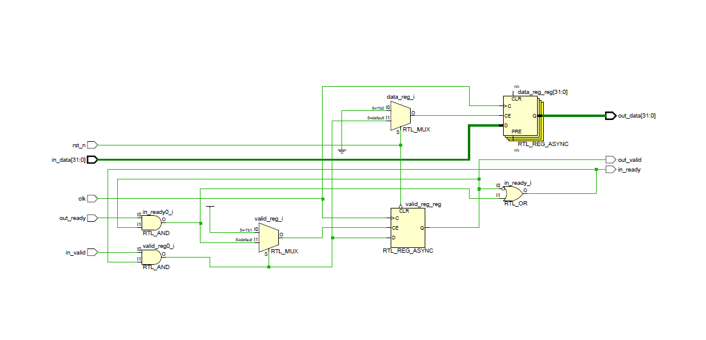
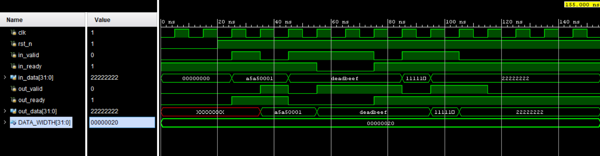

# Single-Stage Pipeline Register (Valid–Ready Handshake)

This repository contains a simple, fully synthesizable **single-stage pipeline register** implemented in **SystemVerilog**, using a standard **valid–ready handshake** mechanism.

The design accepts input data when `in_valid` and `in_ready` are asserted, stores the data internally, and presents it on the output with `out_valid`. It correctly handles **backpressure** from the downstream interface without any data loss or duplication.

---
## Files

## File Hierarchy

```text
pipeline-register/
├── pipeline_reg.sv        # RTL implementation
├── tb_pipeline_reg.sv    # Testbench
├── images/
│   ├── SimulationWaveform.png
│   └── RTLView.png
└── README.md              # Documentation
```


## Features

- Standard valid–ready handshake implementation  
- Handles downstream backpressure correctly  
- No data loss or duplication  
- Clean reset to an empty state  
- Fully synthesizable RTL  
- Parameterized data width  

---

## Module Interface

### Input Interface
- `in_valid` : Indicates valid input data  
- `in_ready` : Indicates module is ready to accept data  
- `in_data`  : Input data bus  

### Output Interface
- `out_valid` : Indicates valid output data  
- `out_ready` : Downstream ready signal  
- `out_data`  : Output data bus  

---


## Testbench

The included testbench verifies:
- Reset behavior
- Normal data transfer
- Backpressure handling
- Back-to-back data transfers

Simulation completes with a success message after all scenarios are exercised.


---

## Notes

- The design uses a one-deep internal storage register.
- Input readiness is asserted when the register is empty or when the output is being consumed.
- Suitable for use as a basic pipeline stage or buffering element in SoC interconnects.

---

## Author

Pradeep
